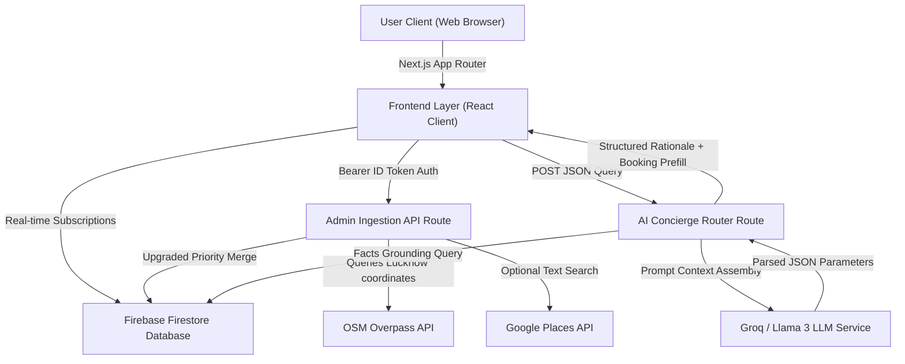
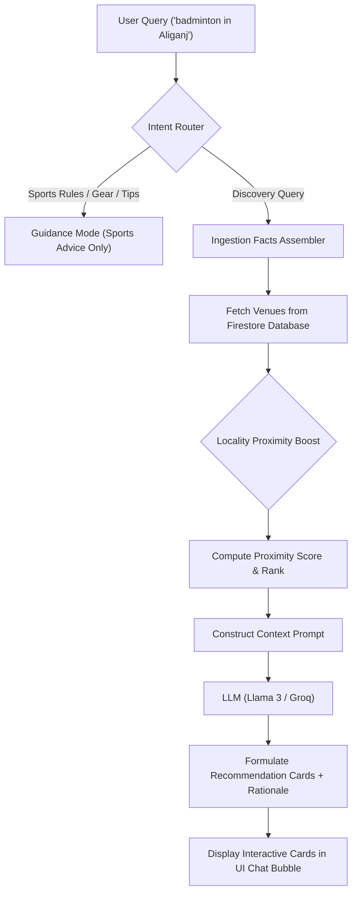

# PlaySphere AI 🎮🏸

> **Next-Generation AI-Assisted Sports Infrastructure Discovery, Real-Time Booking, and Ownership Verification Ecosystem for Lucknow.**

[](https://github.com/devvikax/playsphere-ai)
[](https://nextjs.org/)
[](https://react.dev/)
[](https://firebase.google.com/)
[](https://www.typescriptlang.org/)
[](https://developers.google.com/maps)
[](#ai-integration--intelligence-layer)

---

PlaySphere AI is a premium sports-tech and geographic intelligence platform specifically built for the Lucknow region to bridge the gap between fragmented sports facilities, venue owners, and players. By utilizing a hybrid real-time discovery engine (OpenStreetMap + Seed Ingestion + optional Google Places enrichment), a locality-aware grounded AI Concierge, and a secure Neo-Brutalist booking engine, PlaySphere AI delivers an end-to-end marketplace experience ready for Lucknow's growing sports community.

---

## 👥 Team Information — DeepStack

We are **Team DeepStack**, competing in the **APL Finals 2026**. Below are our team credentials:

| Member | Role | GitHub Profile |
| :--- | :--- | :--- |
| **Vikas Patel** | AI Engineering & Backend Integration | [@devvikax](https://github.com/devvikax) |
| **Suyash Verma** | Database Architecture & Security Rules | [@suyash-verma](https://github.com/suyash-verma) |
| **Shivam Jaiswal** | UI/UX & Responsive Web Layouts | [@shivam-jaiswal](https://github.com/shivam-jaiswal) |
| **Suryansh Singh** | Documentation & Quality Assurance | [@suryansh-singh](https://github.com/suryansh-singh) |

---

## 🎯 Problem Statement

Traditional sports venue discovery and booking in metropolitan Lucknow suffer from acute fragmentation. Players face steep barriers trying to find available cricket turfs, badminton halls, or swimming pools near their locality due to scattered information, opaque pricing, and nonexistent online reservation portals. Many municipal and private sports facilities remain entirely unmapped, rendering public sports complexes underutilized. 

On the vendor side, venue owners lack access to digital management tools, relying instead on manual diaries and phone calls that frequently lead to double-bookings, booking cancellations, and zero metrics on venue activity. Platform administrators also struggle to moderate claims, as there is no structured pipeline to verify that a listing belongs to its legitimate owner. The lack of an intelligent, location-aware recommendation layer means players cannot ask simple natural language queries to discover and lock in their preferred game slots.

---

## 💡 Solution Overview

PlaySphere AI addresses these regional gaps by introducing a secure, map-integrated, and AI-grounded sports venue ecosystem.

*   **Hybrid Real-Time Ingestion**: Admins can trigger an automated crawler that queries the OpenStreetMap (OSM) Overpass API within Lucknow's coordinates to discover stadiums, halls, and pitches, filtering out invalid records and classifying sports automatically.
*   **Locality-Aware Proximity AI**: A conversational assistant parses live Firestore data to recommend sports slots based on the user's distance and budget. The AI concierge applies proximity boosts so that matches closest to neighborhoods like Gomti Nagar or Hazratganj are prioritized.
*   **Marketplace & Ownership Verification**: Discovered infrastructure is kept read-only and unbookable. Venue owners must register, submit verification credentials (payment details, UPI IDs, UTR records), and claim their venue. Once approved by an Admin, the venue opens for bookings.
*   **Simulated Real-Time Bookings**: Players check real-time court availability, book morning/afternoon/evening slots, submit simulated transaction UPI numbers (UTR), and generate active tickets, keeping the marketplace secure and fully verified.

---

## ✨ Key Features

### 🏃 Player Features
*   **Tactile Venue Discovery**: Multi-faceted filtering by sport type, area, price range, availability, and facility type.
*   **Google Maps Navigation**: Visual map pins indicating venue locations, matching colors by sport type, and supporting gesture-cooperative scrolling.
*   **Grounded AI Concierge**: natural language discovery query engine (e.g. *"Find a football turf in Aliganj under 500 rupees"*).
*   **Ticket Dashboard**: Modern ticket viewer featuring automated ID codes (`PS-XXXX-XXXX`), dynamic status badges, and manual booking cancellations.
*   **Tac-Light Theme Switcher**: Instant zero-flash theme transitions between a dark sports arena aesthetic and a warm cream Light mode.

### 🏢 Owner Features
*   **Claim/Verification Requests**: Secure, formal venue claim portal for linking public infrastructure to authenticated owner profiles.
*   **Venue Management Console**: Configure pricing, upload pictures, list amenities, and toggle real-time slot availability.
*   **Active Bookings Checklist**: Interface to track reservations, review player UTR codes, approve payments, and log bookings.
*   **Tactile Revenue Analytics**: Real-time business metrics tracking Confirmation Rate, Revenue, and Venue Activity Ratios.

### 👮 Admin Features
*   **Auto-Ingestion Pipeline**: Core interface to launch the hybrid scanner for municipal and private sports facility discovery.
*   **Ingestion Telemetry Dashboard**: Visual 4x2 grid of counters tracking OSM Raw Fetched, Valid Normalized, Rejected Junk, Added, Updated, Skipped, Enriched, and Ingestion Errors.
*   **Log Console Terminal**: Live-scrolling logs showing the source (Seed, OSM, or Enriched) and duplicate status of every venue processed.
*   **Central approvals queue**: Approve/Reject owner registration claims and monitor the system lock configuration.

### 🧠 AI Features
*   **Booking Prefill Orchestration**: The AI Concierge extracts parameters (venue name, sport, date, time slot) from the chat conversation and builds a prefilled booking drawer, reducing reservations to a single click.
*   **Sports Rules Guidance**: Conversational fallback mode that provides lightweight tips and gear lists while strictly restricting advice to sports.

---

## 📐 System Architecture

PlaySphere AI is designed as a decentralized client-server web app backed by direct Cloud Firestore real-time subscriptions and serverless API endpoints.



### Data Flow
1.  **Discovery**: Admin triggers `/api/admin/discover-infrastructure`. The server crawls Lucknow's coordinate bounding box using the OpenStreetMap Overpass API, filters out junk (empty names, invalid coordinates), performs optional Google Places metadata enrichment, and saves them to Firestore under `source: osm_discovered` (unbookable).
2.  **Claiming**: An Owner registers, submits a claim request with verification documents. Admin reviews and approves the claim. The venue's state changes to `ownerLinked: true, bookable: true`.
3.  **Booking**: A Player searches, selects a slot, and makes a booking. The booking state is written to Firestore, instantly syncing with the Owner's dashboard via real-time hooks.

---

## 🛠️ Tech Stack Details

| Layer | Technology | Purpose |
| :--- | :--- | :--- |
| **Frontend Framework** | **Next.js 16 (App Router + Turbopack)** | Server-side rendering, layout optimization, dynamic page chunks. |
| **Core UI Library** | **React 19** | Component-driven UI rendering and Client Hooks. |
| **Language** | **TypeScript** | Strict typings and type-safe database schemas. |
| **Styling** | **Tailwind CSS v4** | Dark/Light semantic variables mapping and layout responsiveness. |
| **Database** | **Cloud Firestore** | Real-time database synchronizations and direct listener feeds. |
| **Authentication** | **Firebase Auth** | Role-based email sign-in and Google Sign-in redirect fallback. |
| **Maps API** | **Google Maps JS API** | Map visualization, coordinate markers, and InfoWindow overlays. |
| **LLM Orchestration** | **Llama 3 (via Groq API)** | Grounded reasoning, sports guidance, and prefill orchestration. |
| **Icons & Assets** | **Lucide React** | Consistent, high-fidelity SVGs. |

---

## 🧠 AI Integration & Intelligence Layer

PlaySphere AI does not use basic LLM wrapper logic. Instead, it features a custom-built, grounded intelligence architecture.



### 1. Grounded Facts & Anti-Hallucination Controls
To prevent the LLM from hallucinating non-existent venues, pricing tiers, or slots, we perform retrieval-augmented grounding. The server API queries the live Firestore database first to extract *only* valid Lucknow venues. These raw data points are fed into the LLM system prompt as the absolute source of truth. If the user asks for a sport or price range not found in the database, the concierge rejects it immediately.

### 2. Locality Proximity Boost
The ranking engine computes coordinates distance dynamically. If a player searches for a venue in a specific area, the engine calculates the geographical distance between the center of that suburb and the venue's coordinates, applying a mathematical boost to the venue's score. The closest matching venues appear as interactive recommendation cards inside the chat bubble.

### 3. Agentic Booking Prefill Orchestration
When the LLM formulates a venue suggestion, it attempts to extract key parameters (venue ID, date, time slot, sport). If these parameters are complete, the LLM outputs a structured JSON block alongside its text response. The frontend parses this JSON and automatically triggers the Booking prefill drawer.

---

### 💡 AI Tools Used During Development
Following the APL Finals regulations, we separate the AI used to **build** the product from the AI **running inside** the product:

*   **AI Used to Build (Antigravity & Claude)**: Used as agentic coding assistants during development to implement Firebase REST calls, refactor Firestore security rules, design the Neo-Brutalist stylesheet overrides, and write the E2E verification test suite.
*   **AI Running Inside (Llama 3 / Groq)**: Powering the live, production-grade conversational AI Concierge running inside the client application via Next.js server routes.

---

## 📈 APL Finals Development Progress

PlaySphere AI was expanded and hardened significantly during the APL Finals. Below is a timeline of APL Finals commits:

```text
Finals Inception
 ├── [Security Hardening]  ➔ Refactored Firestore Security Rules for claims, bookings, and deletions.
 ├── [Booking Lifecycle]   ➔ Slot validation preventing past bookings; expired/upcoming tabs on Dashboard.
 ├── [Auth Redirect Patch] ➔ Implemented popup-blocked fallback (Popup ➔ redirect) with AuthProvider state listener.
 ├── [Theme System Engine] ➔ Mapped Tailwind slate colors to dynamic variables with head-blocking script.
 ├── [Hybrid OSM pipeline] ➔ Integrated real-time OSM Overpass API crawler with raw/normalized/rejected counters.
 └── [Final Hardening Pass]➔ Upgraded upsert duplicate protection priority and verified E2E check integration.
Finals Submission Ready
```

---

## 🖼️ Screenshots & Previews

> [!NOTE]
> Replace these placeholders with your actual screenshots before finalizing the final submission.

*   **Home Page**: ``
*   **Venues Directory**: ``
*   **Interactive Maps**: ``
*   **AI Concierge Drawer**: ``
*   **Player Dashboard**: ``
*   **Owner Management Panel**: ``
*   **Admin Console Logs**: ``

---

## 🛠️ Setup Instructions

Follow this guide to deploy and run PlaySphere AI locally on your system.

### 1. Prerequisites
*   Node.js (v18 or higher)
*   NPM (v9 or higher)
*   A Firebase Project on Spark (free) or Blaze plan.

### 2. Environment Configurations
Create a `.env.local` file in the root of the project:

```env
# Next.js Public Firebase Client Config
NEXT_PUBLIC_FIREBASE_API_KEY=your-api-key
NEXT_PUBLIC_FIREBASE_AUTH_DOMAIN=your-auth-domain
NEXT_PUBLIC_FIREBASE_PROJECT_ID=your-project-id
NEXT_PUBLIC_FIREBASE_STORAGE_BUCKET=your-storage-bucket
NEXT_PUBLIC_FIREBASE_MESSAGING_SENDER_ID=your-messaging-sender-id
NEXT_PUBLIC_FIREBASE_APP_ID=your-app-id

# Google Maps Javascript SDK Key
NEXT_PUBLIC_GOOGLE_MAPS_API_KEY=your-google-maps-api-key

# Admin Email Whitelist (comma-separated, case-insensitive)
NEXT_PUBLIC_ADMIN_EMAILS=testadmin@gmail.com,testadmin2@gmail.com,testadmin3@gmail.com

# LLM Orchestration Settings (Groq Endpoint)
LLM_API_KEY=your-groq-api-key
LLM_API_URL=https://api.groq.com/openai/v1
LLM_MODEL=llama3-8b-8192
```

### 3. Local Installation & Launch
Run the following commands inside the workspace root:

```bash
# 1. Install dependencies
npm install

# 2. Start the dev server in the background
npm run dev

# 3. Compile the production bundles
npm run build

# 4. Run linter checks
npm run lint

# 5. Check type safety compiler
npx tsc --noEmit -p frontend
```

### 4. Verification Check
Start the Next.js dev server on `http://localhost:3000`, then execute the E2E verification test suite:
```bash
node scratch/test-phase10-final.js
```

---

## 📂 Folder Structure

```text
playsphere-ai/
├── backend/
│   ├── ai/            # Core grounded LLM Concierge and OSM discovery logic
│   └── firebase/      # Firestore db initializations, client queries, and admin config
├── docs/              # Technical specs (timezone policies, setup logs)
├── frontend/
│   ├── public/        # Asset repository
│   └── src/
│       ├── app/       # App routing pages & REST api endpoints
│       ├── components/# Visual layouts, forms, and venue map elements
│       └── contexts/  # React Context APIs (Auth session sync, Theme mode state)
└── shared/
    ├── constants/     # Sports configs and localized default profiles
    ├── helpers/       # Time parsing, ticket naming, and distance tools
    └── types/         # Domain-level typescript type schemas
```

---

## ⚠️ Known Limitations

*   **Payment Simulation**: Payment collection relies on manual player-submitted transaction receipts and UTR numbers. No real bank accounts or UPI gateways are connected.
*   **Geographic Boundaries**: Locality mapping and distance calculations are optimized specifically for the city of Lucknow and its surrounding suburban districts.
*   **Places Ingestion Rate Limits**: Google Places metadata enrichment relies on individual key quota ceilings; the system limits search requests to a maximum of 5 candidates per scan to save API credits.

---

## 🚀 Future Roadmap

*   **Live Occupancy Tracking**: IoT-connected gate sensors to log active counts at court gates.
*   **Dynamic Peak Pricing**: Automated adjustments of hourly slot fees according to local weather forecasts and weekend reservation metrics.
*   **Matchmaking & Match Lobbying**: Player dashboard portals allowing individuals to create public lobbies and find team members for cricket matches.
*   **Lucknow Sports Network Expansion**: Onboarding more Lucknow sports clubs and private academies.

---

## 🔒 Security & Validation

*   **Database Isolation Rules**: Guarded via `firestore.rules` preventing players from modifying venues, auditing other users' reservations, or deleting historical bookings that are not in a cancelled state.
*   **Scan Locking Mechanism**: Ingestion locks prevent concurrent scans, ensuring only one admin can run discovery scans at a time, backed by a strict 5-minute scan cooldown.
*   **Server Authentication**: Admin routes verify Bearer Authorization ID tokens directly against Firebase Admin Auth APIs.

---

## 🏆 Final Round Submission

*   **Project Title**: PlaySphere AI
*   **Track**: Sports-Tech & Geographic Discovery Intelligence
*   **Team Name**: DeepStack
*   **API Credentials**: Mapped to standard sandbox variables
*   **GitHub Repository**: `https://github.com/devvikax/playsphere-ai`
*   **Demo Video link**: `[Placeholder — Update before final submission]`

---

Built with AI-assisted development and sports-tech innovation by **Team DeepStack** for APL Finals 2026.
