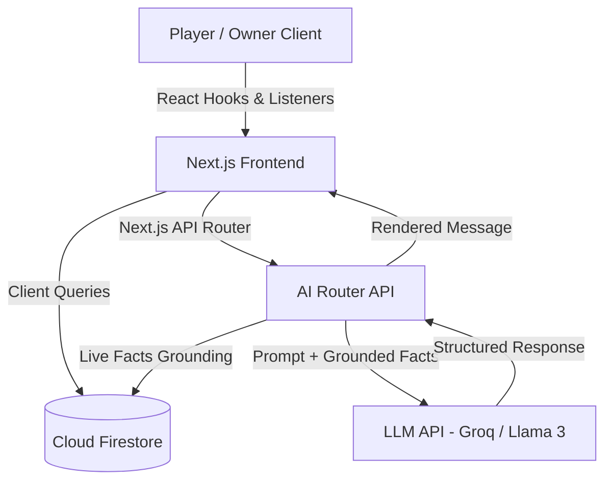

# PlaySphere AI 🎮🏸

> **AI-powered sports infrastructure discovery and booking platform for Lucknow.**

PlaySphere AI is a premium, high-performance web platform designed to streamline sports venue discovery and booking in Lucknow. Backed by real-time Firestore synchronization and a grounded, dual-mode AI Concierge system, it bridges the gap between sports enthusiasts, venue owners, and platform administrators.

---

## 🛡️ Badges & Tech Stack


---

## 🎯 Problem Statement

Traditional sports venue discovery in Lucknow is highly fragmented. Players struggle with opaque pricing, complex booking schedules, and lack of real-time availability. Venue owners face issues with manual bookings, metrics tracking, and payout transparency.

**PlaySphere AI solves this by introducing:**
1. An instant, map-integrated venue search engine.
2. A grounded AI Concierge that parses live database records to recommend slots based on price, proximity, and features.
3. An E2E marketplace workflow with instant state synchronization.

---

## ✨ Key Features

*   🔍 **Venue Discovery**: Fast search and filtering by sport type, area, price range, availability, and skill level.
*   🗺️ **Google Maps Integration**: Visual venue pinning, cooperative scrolling, and instant location lookup on a responsive viewport.
*   🤖 **AI Concierge**: Dual-mode conversational assistant for venue recommendations and game rules, supporting AI-assisted booking orchestration (agentic booking prefill) to streamline player reservations.
*   ⚡ **Real-Time Venue Sync**: Venues disappear or reappear dynamically based on availability toggles without requiring a page reload.
*   📅 **Smart Booking Management**: Secure, non-overlapping slot reservations calculated via morning, afternoon, and evening pricing tiers.
*   💸 **Payment Verification**: Manual UTR submission and owner-side instant validation.
*   🎟️ **Ticket Generation**: Automatic unique ticket numbering (`PS-XXXX-XXXX`) and status updates.
*   📊 **Owner Analytics**: Real-time analytics displaying Most Popular Venue, Confirmation Rate, and Venue Activity Ratio.
*   👮 **Admin Moderation**: Central panel for reviewing owner signups and managing marketplace approvals.
*   🧠 **Grounded AI Insights**: Programmatic discovery analytics calculating regional venue gaps, pricing models, and density indices directly from Firestore data.

---

## 👥 System Roles

| Role | Core Capabilities |
| :--- | :--- |
| **Player** | Browse venues on Map, query AI Concierge, book slots, submit payment proofs, and track tickets. |
| **Venue Owner** | Manage venue listings, toggle real-time availability, configure payment details, approve bookings, and view performance analytics. |
| **Admin** | Moderating the marketplace, approving/rejecting venue owners, and viewing platform-wide active statistics. |

---

## 🤖 AI Concierge Overview

The AI Concierge is a dual-mode conversational assistant backed by **Llama 3 (via Groq/OpenAI-compatible endpoints)**:

*   **Discovery Mode**: Dynamically parses live Firestore data to answer query intents (e.g. *"Find a badminton court in Gomti Nagar under 350 rupees"*). It is strictly grounded to prevent hallucinations of non-existent prices, locations, or discounts.
*   **Guidance Mode**: Provides lightweight game rules, safety tips, and gear suggestions (e.g. *"beginner tips to hold a racket"*). Safe guardrails block non-sports advice (e.g. medical or professional coaching).
*   **Failover & Retries**: Automatic endpoint fallback handling with user-facing retry states in the conversational UI.

---

## 🛠️ Tech Stack Details

*   **Frontend**: Next.js 16 (App Router + Turbopack), React 19, TypeScript, Tailwind CSS, Lucide icons.
*   **Backend**: Firebase (Client SDK + Admin SDK), Firestore Database, Firestore Security Rules (denying unauthorized cross-owner updates and player role escalation).
*   **API Routing**: Next.js Dynamic API Routes with parameters parsing.
*   **APIs**: Google Maps JavaScript API (with gesture cooperative handling), Groq / OpenAI compatible LLM endpoint.

---

## 📐 Architecture Overview



---

## 📂 Project Structure

```text
playsphere-ai/
├── backend/
│   ├── ai/            # AI Concierge, grounding, and insights logic
│   └── firebase/      # Cloud Firestore initialization, queries, and listeners
├── docs/              # Architecture, setup, and AI documentation
├── frontend/
│   ├── public/        # Asset repository
│   └── src/
│       ├── app/       # Next.js App Router (Pages, Layouts, API routes)
│       ├── components/# Reusable UI elements (AI, venue, layout modules)
│       ├── contexts/  # Context API providers (Auth session management)
│       └── middleware.ts
├── shared/
│   ├── constants/     # Core static data configs
│   ├── helpers/       # Pricing, ticket generators, and validation helpers
│   └── types/         # Domain-specific TypeScript models
├── firebase.json      # Emulator & deployment settings
├── firestore.rules    # Secure database access rules
└── package.json       # App scripts and dependencies
```

---

## 🖼️ Screenshots & Previews

### Homepage Preview


### AI Concierge Preview


### Owner Dashboard Preview


### Maps View Preview


### Booking Flow Preview


---

## 🚀 Local Setup

### Prerequisites
*   Node.js (v18+)
*   NPM (v9+)
*   Firebase CLI (optional for rules deployment)

### 📋 Environment Variables
Create a `.env.local` file inside the root directory and configure the following keys:

```env
# Next.js Public Firebase Config
NEXT_PUBLIC_FIREBASE_API_KEY=your_firebase_api_key
NEXT_PUBLIC_FIREBASE_AUTH_DOMAIN=your_project_auth_domain
NEXT_PUBLIC_FIREBASE_PROJECT_ID=your_project_id
NEXT_PUBLIC_FIREBASE_STORAGE_BUCKET=your_storage_bucket
NEXT_PUBLIC_FIREBASE_MESSAGING_SENDER_ID=your_sender_id
NEXT_PUBLIC_FIREBASE_APP_ID=your_app_id

# Google Maps API Key
NEXT_PUBLIC_GOOGLE_MAPS_API_KEY=your_google_maps_api_key

# AI Configuration (Groq / OpenAI-compatible endpoint)
LLM_API_KEY=your_groq_api_key
LLM_API_URL=https://api.groq.com/openai/v1
LLM_MODEL=llama3-8b-8192
```

### 💻 Run Commands

1. **Clone the repository and install dependencies**:
   ```bash
   git clone https://github.com/your-username/playsphere-ai.git
   cd playsphere-ai
   npm install
   ```

2. **Run in development mode**:
   ```bash
   npm run dev
   ```
   *The application will start on [http://localhost:3000](http://localhost:3000).*

3. **Verify type safety and lint checks**:
   ```bash
   npx tsc --noEmit --project frontend/tsconfig.json
   npm run lint
   ```

4. **Compile for production**:
   ```bash
   npm run build
   npm start
   ```

---

## 🔒 Security Notes
*   **Hardened Infrastructure Discovery API**: The `/api/admin/discover-infrastructure` route requires token-based Admin authentication via Firebase client ID token verification on the server side against the `NEXT_PUBLIC_ADMIN_EMAILS` list and roles schema.
*   **Scan Lock & Cooldown**: Only 1 active discovery scan can execute globally. Firestore state locks prevent concurrent runs, and a strict 5-minute cooldown prevents endpoint spamming.
*   **Firestore Rules**: Direct collections operations are guarded by `firestore.rules` preventing data manipulation. Only owners can approve bookings, and users cannot modify profiles or booking records of other players.
*   **Secrets Isolation**: All secrets are securely isolated in `.env.local` which is strictly ignored by Git patterns.

---

## 🚀 Future Improvements
*   **Payment Gateway Integration**: Upgrade the simulated UTR verification system to secure online payment routes (Razorpay/Stripe).
*   **Offline Mode**: Enable offline caching using Firestore offline persistency.
*   **AI Auto-Moderation**: Automatically process and flag fake payment screenshots using LLM multimodal capabilities.

---

## 👥 Team Details — DeepStack

*   **Suryansh Singh** — Documentation & Demo
*   **Shivam Jaiswal** — Frontend & UI Layouts
*   **Suyash Verma** — Backend & Database Transactions
*   **Vikas Patel** — AI Engineering & Integration

---

## 📝 License
This project is licensed under the MIT License - see the LICENSE file for details.

---
*Created with ❤️ by Team DeepStack for Lucknow Sports Hackathon.*
