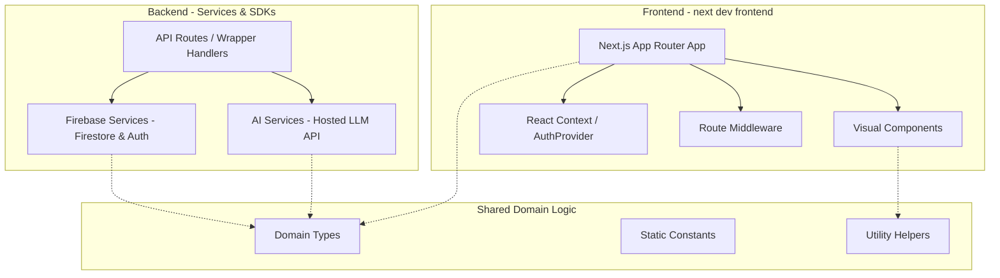
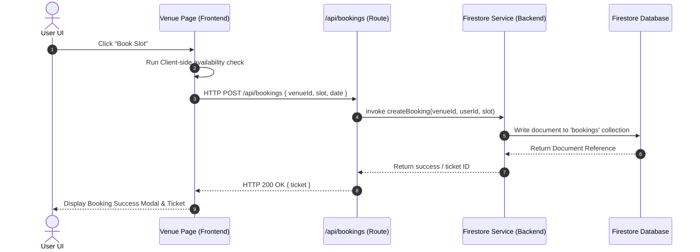

# System Architecture Guide

This document describes the design patterns, architecture boundaries, and cross-layer call flows of **PlaySphere AI**.

---

## 🏗️ Layered Architecture Overview

The system is separated into three distinct layers to ensure separation of concerns, testability, and clarity for developers.

### 1. Frontend Layer
* **App Router (`frontend/src/app`)**: Decides the routing, layout, and page components. Pages act as entrypoints that mount client-side templates and connect state events to actions.
* **Visual Components (`frontend/src/components`)**: Reusable widgets (cards, maps, dashboards) styled using Tailwind CSS and CSS variables.
* **Contexts (`frontend/src/contexts`)**: Handles global React state. For example, `AuthProvider` uses the client-side Firebase SDK to listen to auth state changes and expose the logged-in user profile.

### 2. Backend Layer
* **API Handlers (`frontend/src/app/api`)**: Acts as proxy layers. They intercept HTTP requests, validate request bodies, and delegate the business logic to the backend services.
* **AI Services (`backend/ai`)**: Performs prompting, prompt engineering, and talks to the OpenAI-compatible hosted LLM API.
* **Firebase Services (`backend/firebase`)**: Directly queries Firestore and performs authentication logic.

### 3. Shared Layer
* Includes shared configurations, helper methods, pricing models, and Typescript types. No layer has exclusive ownership; frontend page routing, visual components, API endpoints, and Firestore collections all import from `shared/`.

---

## 🔄 Core Call Flow Sequence (Example: Booking a Slot)

This diagram shows how a user action on the frontend traverses through the layers to complete a booking in Firestore:

---

## 🎨 Theme & Styling System
We use a **Neo-Brutalist design language** featuring:
1. **Bold Borders**: Consistent 3px solid black (`border-3 border-black`) borders.
2. **High-Contrast Shadows**: Hard, non-blurry shadows using `box-shadow` (e.g. `box-shadow: 4px 4px 0px #000000;`).
3. **Stark Colors**: Neon yellows (`#facc15`), cyans (`#22d3ee`), and pinks (`#f472b6`) offset by deep space darks (`#080a10`).
4. **Interactive Offsets**: Interactive elements translate slightly on hover and press (e.g. `translate(-2px, -2px)`) while altering shadow weights to give a tactile feel.
